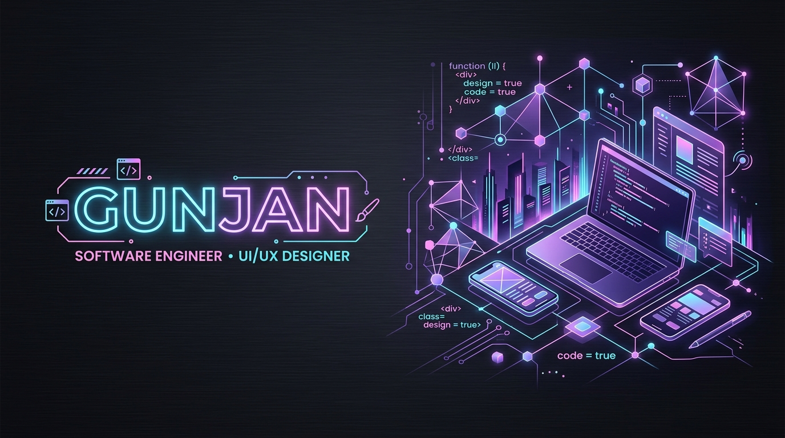

<div align="center">

  <!-- HERO BANNER -->
  

  <br/><br/>

  <!-- DYNAMIC TYPING SVG HEADER -->
  <a href="https://github.com/Gunjannnn30">
    
  </a>

  <p align="center">
    <strong>Running on iced coffee ☕, neural nets 🧠, and pixel-perfect design systems 🎨</strong>
  </p>

  <!-- QUICK STATUS PILLS -->
  <p align="center">
    <a href="https://github.com/Gunjannnn30"></a>
    <a href="https://github.com/Gunjannnn30/RAG-Pipeline-Hybrid-Search"></a>
    <a href="mailto:gunjan.workbusiness@gmail.com"></a>
    <a href="https://github.com/Gunjannnn30"></a>
  </p>

</div>

---

### 💻 `gunjan@workstation:~$ cat profile.json`

```json
{
  "name": "Gunjan Jain",
  "identity": "Full-Stack AI Engineer & Creative UI/UX Designer",
  "location": "India 🇮🇳",
  "status": "Engineering next-gen AI platforms & crafting aesthetic interfaces",
  "core_stack": ["Python", "FastAPI", "React 18", "Node.js", "Ollama", "ChromaDB", "Tailwind CSS"],
  "design_stack": ["Figma", "UI/UX Prototyping", "Design Systems", "Micro-Interactions"],
  "philosophy": "Software shouldn't just be functional — it should look gorgeous and feel effortless.",
  "coffee_intake": "Exponential ☕📈"
}
```

---

## 💼 Featured Design & Engineering Portfolio

<table width="100%">
  <tr>
    <td width="50%" valign="top">
      <div align="center">
        <h3>🔍 01. Enterprise RAG Pipeline with Hybrid Search</h3>
        <p><strong>Production-Grade Information Retrieval & Hallucination Prevention</strong></p>
      </div>
      <p>
        An enterprise-ready Retrieval-Augmented Generation platform built to eliminate semantic drift, context pollution, and unverified LLM hallucinations over dense proprietary corpora.
      </p>
      <ul>
        <li><strong>Dual Retrieval:</strong> Concurrent Dense Semantic Vectors (ChromaDB) + Sparse BM25 fused with Reciprocal Rank Fusion (RRF).</li>
        <li><strong>Cross-Encoder Reranker:</strong> Multi-threaded LLM-as-judge scoring top-20 candidates down to top-5 high-signal chunks.</li>
        <li><strong>NLI Citation Auditing:</strong> Automated sentence-by-sentence Natural Language Inference verification.</li>
        <li><strong>Obsidian Slate Studio:</strong> Custom sleek dark-mode UI with real-time confidence telemetry and cluster metrics.</li>
        <li><strong>Privacy:</strong> 100% offline & local via Ollama — zero cloud data leaks.</li>
      </ul>
      <p align="center">
        <a href="https://github.com/Gunjannnn30/RAG-Pipeline-Hybrid-Search"></a>
        <a href="https://github.com/Gunjannnn30/RAG-Pipeline-Hybrid-Search"></a>
      </p>
      <div align="center">
        <code>Python 3.11+</code> · <code>FastAPI</code> · <code>Ollama</code> · <code>ChromaDB</code> · <code>Streamlit</code> · <code>React</code> · <code>Docker</code>
      </div>
    </td>
    <td width="50%" valign="top">
      <div align="center">
        <h3>🎯 02. Skill2Career Engine — AI Career Mapping</h3>
        <p><strong>Intelligent Career Roadmapping with Resilient Fallback Architecture</strong></p>
      </div>
      <p>
        An AI-powered guidance platform that analyzes candidate resumes, pinpoints market skill deficiencies, and generates step-by-step career acceleration roadmaps.
      </p>
      <ul>
        <li><strong>Generative Intelligence:</strong> Google Gemini API integration with dual-tier fallback (<code>gemini-3.1-flash-lite</code> ➔ <code>gemini-2.5-flash</code>).</li>
        <li><strong>Deterministic Rule Safety:</strong> Offline keyword heuristic engine guarantees uninterrupted UX even during API rate limits.</li>
        <li><strong>In-Memory Parsing:</strong> High-speed resume extraction with zero persistent storage of sensitive user PDFs.</li>
        <li><strong>Interactive Design:</strong> Dynamic roadmap visualization, Guest Mode, and client-side vector-styled PDF export.</li>
        <li><strong>Production Live:</strong> Scaled on Render (backend) and Vercel (frontend edge).</li>
      </ul>
      <p align="center">
        <a href="https://github.com/Gunjannnn30/skill2career-engine"></a>
        <a href="https://github.com/Gunjannnn30/skill2career-engine"></a>
      </p>
      <div align="center">
        <code>React 18.3</code> · <code>Node.js</code> · <code>Express</code> · <code>MongoDB Atlas</code> · <code>Gemini API</code> · <code>Tailwind</code>
      </div>
    </td>
  </tr>
</table>

---

## 🎨 Creative Arsenal & Technical Stack

<div align="center">

| Domain | Technologies & Design Tools |
| :--- | :--- |
| **🎨 UI/UX & Design Systems** | `Figma` `Design Systems` `Wireframing` `User Journey Mapping` `Interactive Prototyping` `Micro-Interactions` `Design Tokens` |
| **💻 Frontend Engineering** | `React 18` `JavaScript (ES6+)` `Tailwind CSS` `Streamlit` `HTML5 / CSS3` `Lucide Icons` `jsPDF` `Vite` |
| **🧠 AI, RAG & LLMs** | `Local LLMs (Ollama)` `Google Gemini API` `ChromaDB Vector Store` `BM25 Sparse Retrieval` `Reciprocal Rank Fusion (RRF)` `Cross-Encoder Rerankers` `NLI Entailment` |
| **⚡ Backend & Databases** | `Python 3.11+` `FastAPI` `Node.js` `Express.js` `MongoDB Atlas` `Mongoose` `RESTful APIs` `JWT Auth` |
| **🛠️ DevOps, Testing & Tools** | `Docker` `PyTest (59 Suites)` `Git & GitHub` `Vercel` `Render` `Postman` `CI/CD Pipelines` |

<br/>

<!-- MODERN ICON BADGES -->
<p align="center">
  
</p>

</div>

---

## 🏆 Key Achievements & Milestones

<table>
  <tr>
    <td width="33%" align="center">
      <h3>🛡️ 59 / 59</h3>
      <p><strong>Automated Test Suites</strong></p>
      <p>Engineered zero-regression test coverage spanning dense retrieval, reranking matrices, and edge-case abstention flows.</p>
    </td>
    <td width="33%" align="center">
      <h3>📚 500K+</h3>
      <p><strong>Corpus Evaluation</strong></p>
      <p>Benchmarked hybrid search and reciprocal rank fusion over 500K+ complex enterprise docs on EnterpriseRAG-Bench.</p>
    </td>
    <td width="33%" align="center">
      <h3>🔒 100%</h3>
      <p><strong>Offline Local Privacy</strong></p>
      <p>Architected completely sovereign AI pipelines running on Ollama with zero token costs and zero external cloud leaks.</p>
    </td>
  </tr>
  <tr>
    <td width="33%" align="center">
      <h3>🚀 Production</h3>
      <p><strong>Live Deployments</strong></p>
      <p>Built and deployed production-grade MERN + AI architectures on Render with edge client routing on Vercel.</p>
    </td>
    <td width="33%" align="center">
      <h3>🎨 Custom UI</h3>
      <p><strong>Obsidian Slate Design</strong></p>
      <p>Authored cohesive high-contrast dark themes with real-time telemetry gauges and confidence visualizers.</p>
    </td>
    <td width="33%" align="center">
      <h3>⚡ Graceful Degrade</h3>
      <p><strong>Resilient Fallback Engine</strong></p>
      <p>Implemented deterministic rule matchers to prevent broken UI states during third-party LLM rate-limit events.</p>
    </td>
  </tr>
</table>

---

## 📊 Telemetry & GitHub Analytics

<div align="center">

  <!-- GITHUB STATS & STREAK -->
  <table border="0">
    <tr>
      <td>
        <a href="https://github.com/Gunjannnn30">
          
        </a>
      </td>
      <td>
        <a href="https://github.com/Gunjannnn30">
          
        </a>
      </td>
    </tr>
  </table>

  <br/>

  <!-- TOP LANGUAGES -->
  <a href="https://github.com/Gunjannnn30">
    
  </a>

  <br/><br/>

  <!-- ACTIVITY GRAPH -->
  <a href="https://github.com/Gunjannnn30">
    
  </a>

  <br/><br/>

  <!-- GITHUB TROPHIES -->
  <a href="https://github.com/Gunjannnn30">
    
  </a>

</div>

---

## 🌸 The Tech Girl Vibe & Workspace Setup

```
┌──────────────────────────────────────────────────────────────┐
│  🎧 Currently Vibing To: Cyberpunk Synthwave & Lo-Fi Beats   │
│  ⌨️  Keyboard: Mechanical Tactile switches with RGB Glow      │
│  🖥️  Display: Dark Mode everything · High DPI canvas          │
│  🍵 Fuel of Choice: Iced Caramel Macchiatos & Matcha Latte   │
│  🔮 Design Inspo: Cyber-minimalism, Glassmorphism, Neon Lilac │
│  🌸 Motto: "Code with precision, design with empathy."       │
└──────────────────────────────────────────────────────────────┘
```

---

## 📬 Let's Connect & Collaborate!

<div align="center">

Whether you're looking to discuss **Production RAG systems**, explore **cutting-edge UI/UX design**, collaborate on open-source, or just chat about AI architectures and iced coffee — my inbox is always open!

<br/>

<a href="mailto:gunjan.workbusiness@gmail.com">
  
</a>
<a href="https://github.com/Gunjannnn30">
  
</a>
<a href="https://linkedin.com">
  
</a>

<br/><br/>

<!-- VISITOR COUNTER -->


<br/><br/>

<sub>Crafted with 💜 and lots of caffeine by **Gunjan Jain** · © 2026</sub>

</div>
